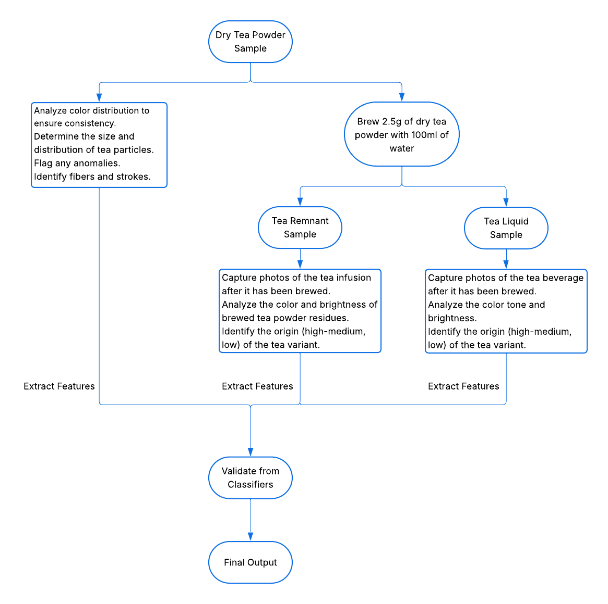

# QualiTea – Automated Tea Quality Assessment System

QualiTea is an innovative, end-to-end automated system designed to objectively evaluate the quality of black tea. By leveraging advanced image processing and machine learning techniques, it analyzes dry tea particles, brewed tea liquid, and infusion leaves. This system replaces subjective human grading with a consistent, data-driven approach, making it ideal for commercial deployment in tea production and quality control lines.

## Features

•Assesses tea quality across three critical states: dry leaves, brewed liquid, and infused (wet) leaves. 
•Identifies and quantifies key quality indicators such as tea fibers and particle strokes. 
•Precisely extracts a wide array of features, including color, size, shape, and texture from tea samples. 
•Employs powerful machine learning models (Random Forest, SVM, Neural Networks) for high-accuracy prediction of tea variants and elevation levels. 
•Incorporates sophisticated image processing algorithms for robust particle segmentation and overlap handling, ensuring precise analysis. 
•Modular architecture with front-end (UI) and back-end (processing + ML models) 

## System Architecture

## Technologies Used
Backend & ML: Python, OpenCV, Scikit-learn (Random Forest, SVM), TensorFlow, Pandas, NumPy

Frontend: React
